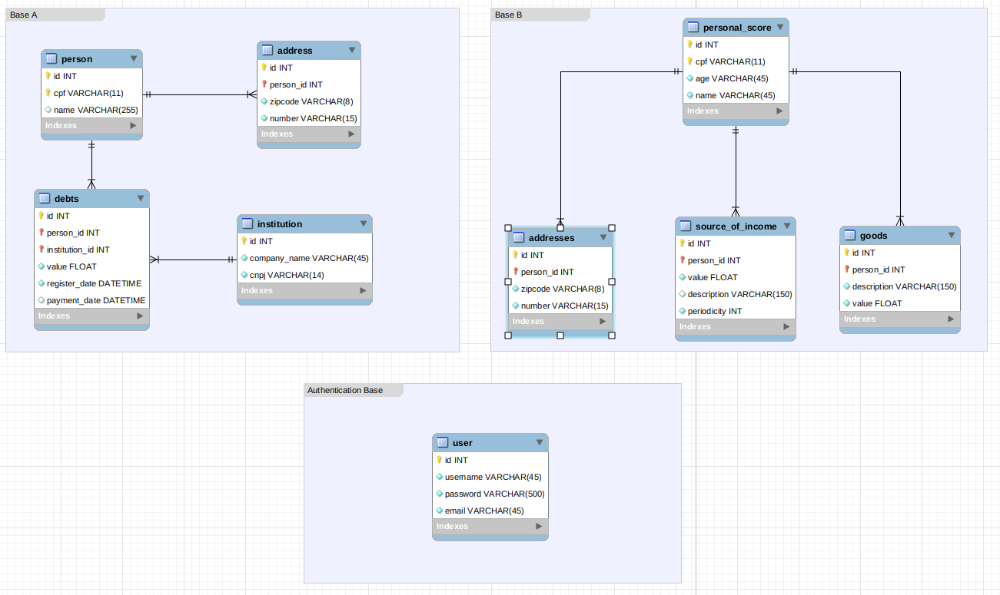

# Aplicação de desafio

Esse documento descreve a solução de um desafio de uma aplicação segura, rápida e crítica.

# Resumo do problema

Há uma grande necessidade de **armazenamento, processamento e disponibilidade** de uma grande massa de dados de uma forma **segura**.

Para organizar tais dados, existem três bases de dados denominadas A, B e C. Cada uma delas com uma necessidades diferentes de acesso a dados, como segue abaixo:

- **Base A:** Possui dados **sensíveis** e **não** necessita de **um acesso rápido**, porém **necessita do máximo de segurança**
- **Base B:** Possui dados **sensíveis**, necessita de **um acesso mais rápido**, é usada por um **sistema de aprendizagem de máquina (ML)** e também necessita do **máximo de segurança**
- **Base C:** **Não** possui **dados críticos** e precisa ser **extremamente rápido**

Essas bases serão acessadas por aplicações em arquitetura de microserviços e nanoserviços.

Existe um sistema para cada um desses banco de dados que fazem o acesso e recuperam os dados ali contidos.

# Proposta de solução

A proposta de solução considerará os seguintes fatores:

- Performance
- Segurança
- Custo

# Discussão

Seguindo o princípio do "dividir para conquistar", vamos isolar cada um dos problemas e resolve-los individualmente.

## Problema 1 - **Base A:**

Há uma alta necessidade de segurança de dados, pois tratam-se de dados sensíveis. O lado positivo é que sua consulta não precisa ser rápida, e por isso não precisamos entrar no trade-off entre segurança vs performance. Mas antes de continuar, precisamos debater o que necessariamente significa **segurança da informação**, que é um tópico bem extenso dentro da Tecnologia da Informação (TI)

Em resumo, como o próprio nome sugere, a **segurança da informação** se refere a impedir que pessoas não-autorizadas tenham acesso a informações sigilosas. É importante ter em mente que nenhum sistema é 100% seguro, por vários fatores - sejam eles humanos ou técnicos. Porém há formas de mitigar o risco dos dados cairem em mãos erradas, como por exemplo utilizando a **criptografia** e estabelecendo **processos**. Mas como isso resolve o problema e também como implementar essas soluções num cenário real? Simples, **A criptografia** faz com que as informações do seu banco não fiquem em texto-limpo. Ou seja, mesmo que alguém roube sua base dados não vai adiantar nada, a menos que essa pessoa possua a chave privada e a senha para descriptografa-los. **Os processos** servem justamente para evitar que a chave privada e a senha também sejam hackeadas. Um bom exemplo, é quando um funcionário sai da empresa. Se não houver um processo de troca de chave e senha, o ex-colaborador vai continuar tendo acesso a base, o que não é desejável. Obviamente, esses não são os únicos meios de proteger as informações de um sistema. Podemos utilizar Firewalls e permitir acesso a base apenas de IP's autorizados, por exemplo.

Mas como implementar tudo isso na prática?

A Amazon oferece suporte com algumas ferramentas, como por exemplo o RDS. Essa ferramenta permite fazer [a criptografia dos banco de dados](https://docs.aws.amazon.com/AmazonRDS/latest/UserGuide/Overview.Encryption.html), o que resolve parte dos nossos problemas.

Além disso, as regras do _Security Groups_ garantem acesso apenas a IPs autorizados.

E para garantir que não haja nenhum ataque pela rede, é recomendável sempre o uso de _VPC (Virual Private Cloud)_ com SSL.

Obviamente toda essa criptografia tem um custo: **Performance**. Porém, nessa situação a segurança é mais prioritária do que o desempenho, então vale a pena ter esse custo.

Outro ponto fundamental é o fato de que dados sensíveis devem ser **consistentes**. Para garantir isso, podemos utilizar **os banco de dados relacionais** que geralmente atendem aos princípios do [ACID](https://pt.wikipedia.org/wiki/ACID), resolvendo dessa forma o problema da consistência de dados. Claro que o ACID por si só não resolve o problema, o programador tem que usa-lo. Contudo, o fato de o SGBD ter suporte a esse tipo de mecanismo já ajuda bastante no projeto.

## Problema 2 - **Base B:**

Neste caso, temos o mesmo problema da **Base A**, com a diferença que não podemos ignorar a questão da performance. Além disso, precisamos dar suporte a um algoritmo de Machine Learning, o que causa uma carga de consultas maior de consulta a este banco.

A solução seria a mesma da **Base A**, com um pequeno _improvement_: Utilizar réplicas.

Dessa forma, garantimos a mesma segurança da **Base A**, porém podemos fazer múltiplas leituras simultâneamente, o que diminui o tempo de consulta. Inclusive podemos utilizar uma réplica exclusivamente para o sistema de **_Machine Learning_**

Além dessa abordagem, uma arquitetura que poderia ser bastante útil para aumentar a performance do banco de dados seria a [arquitetura shard](https://en.wikipedia.org/wiki/Shard_(database_architecture)), que permite leitura e escrita de forma paralela, o que aumentaria o throughput de I/O. Nesse caso, poderiamos utilizar uma instância de banco de dados por estado, mantendo as informações sempre organizadas.

Alguns outros _tunnings_ ainda podem ser feitos, como por exemplo, a criação de índices no banco de dados, a fim de tornar a busca mais rápida.

## Problema 3 - **Base C:**

Para a **Base C** devemos ter como prioridade a performance, e temos como vantagem o fato de que não se tratam de dados sensíveis, podemos perder um pouco da segurança em detrimento da performance. Isso não quer dizer que vamos deixar a base de dados vulnerável, mas alguns passos adicionais de segurança podem ser removidos, como por exemplo, a criptografia dos dados armazenados. Os outros mecanismos de segurança tais como _firewall_, SSL e credenciais do banco **devem** ser mantidos.

Contudo, podemos utilizar um banco de dados cujo o funcionamento nos permita ter todos esses benefícios. Para esse caso, a escolha ideal seria o **Redis**. Mas por que? Primeiramente, sabemos que o acesso a memória é muito mais rápido do que o acesso a disco, de acordo com a [hierarquia de memória](https://pt.wikipedia.org/wiki/Hierarquia_da_mem%C3%B3ria). Além disso, o **Redis** é um In-Memory Database (IMDB) híbrido, ou seja, ele também persiste os dados no disco. A escrita de disco não funciona igual a um banco de dados convencional. O que acontece, é que todo evento (isto é, inserção, atualização ou remoção) no dado é gravado **sequencialmente** em um log. Pelo fato dessa gravação ser **sequencial** e não **randomica**, a gravação no disco fica muito mais rápida. Através desse log, fica fácil remontar a informação que está em memória, já que se tem todo o histórico.

## Problema 4: **Aplicações**

Além de assegurar a segurança dos bancos de dados, também devemos assegurar que nossa aplicação está segura, pois ela tem acesso direto aos dados. Se ela não estiver segura, tudo estará perdido.

### Segurança em Aplicações Web

Existem alguns pontos de atenção bastante conhecidos, em relação a desenvolvimento web seguro, como por exemplo o [SQL Injection](https://www.devmedia.com.br/sql-injection/6102), o [Cross-site Scripting (XSS)](https://pt.wikipedia.org/wiki/Cross-site_scripting), o [Cross-site request forgery (CSRF/XSRF)](https://pt.wikipedia.org/wiki/Cross-site_request_forgery), [CORS Attack](https://www.owasp.org/index.php/CORS_OriginHeaderScrutiny), etc. Existem algumas organizações que podem nos ajudar a desenvolver sistemas web seguros, como por exemplo a [OWASP](https://www.owasp.org/). O desenvolvedor deve conhecer essas vulnerabilidades para não cometer esses erros na hora do desenvolvimento de uma aplicação. Usar sempre as últimas versões das bibliotecas de fontes confiáveis é também uma boa prática.

É fundamental que o sistema como todo esteja preocupado com o desenvolvimento seguro, ponta a ponta. Apesar da maioria dos desenvolvedores terem conhecimentos básicos de segurança, o ideal seria contratar uma empresa para realizar um [Penetration Test (Pentest)](https://pt.wikipedia.org/wiki/Teste_de_intrus%C3%A3o), pois nesse caso, esse tipo de empresa tem muito mais domínio em termos de segurança em desenvolvimento web do que até mesmo os desenvolvedores que têm algum conhecimento em desenvolvimento seguro. Como falei anteriormente, segurança de informação é um tópico muito largo dentro da área de TI, e também está em constante evolução. A vantagem é que você tem uma espécie de "_double check_" na sua aplicação, pois além do time de qualidade e de desenvolvimento, uma empresa a mais fará a validação de segurança.

### Autenticação e Autorização

Ainda se tratando de segurança, devemos ter um sistema robusto de autenticação e autorização.

- **Autenticação:** É o processo de garantir a identidade e a autenticidade de um usuário. Isso é importante pois estamos em aplicações onde se trafegam dados sensíveis, e queremos saber quem está acessando tais informações.
- **Autorização:** É o processo de dar ou negar permissão de uma informação a um usuário, dependendo de sua função.

Esses conceitos são fundamentais para uma aplicação web. Há várias maneiras de garantir autenticação e autorização, dentre elas podemos citar Login, Multi-Factor Authentication (MFA), Role-based Authorization, password confirmation, etc.

Pode-se utilizar o protocolo **[JWT](https://jwt.io/introduction/)** que é um padrão de indústria para se resolver a autenticação, e baseado na identidade do usuário, resolver as suas permissões.

## Trade-offs: desvantagens da proposta e pontos positivos

_"Nada pode ser obtido sem sacrifício. Para se obter algo é preciso oferecer algo em troca de igual valor. Esse é o princípio da Troca Equivalente."_ - Edward Elric

A citação acima se encaixa muito bem nesse contexto. Não tem como obter todas as vantagens sempre. Tudo tem um custo, e nessa seção eu irei falar mais deles.

- **Consistência Eventual:** A réplica não é atualizada de forma síncrona. Isso significa dizer que nem sempre os dados das réplicas estarão sincronizados com o banco de dados principal. Contudo, o tempo de atualização não é alto, e para essa situação em específico vale a pena.
- **Custo:** Obviamente, para ganhar em performance e segurança, deve-se perder em outro ponto: O custo. Isso porque a Amazon cobra por cada réplica. Além disso, ao utilizar índices, o tamanho do banco de dados também aumenta, o que também aumenta o custo.
- **Observação importante:** Todos os mecanismos citados poderia ser feito sem a Amazon? Claro que **sim**. Os bancos de dados têm seus próprios mecanismos de criptografia, como por exemplo o [MySQL](https://www.mysql.com/products/enterprise/encryption.html) e o [PostgreSQL](https://www.postgresql.org/docs/current/encryption-options.html). Ao invés da _VPC_, podemos ter nossa própria rede local. E também podemos substituir as réplicas por _Databases Clusters_. Porém novamente, temos um outro trade-off: primeiramente o trabalho seria muito maior para configurar e manter isso tudo em ordem. Além disso, perderíamos a flexbilidade de poder escalar nossos servidores banco de dados de uma forma fácil. E também teríamos custos com servidores. A pergunta é se manter isso tudo vale a pena.

# A aplicação desenvolvida

Toda a aplicação foi desenvolvida usando docker, para facilitar a comunicação entre os serviços, e também para rodar em todos os ambientes de forma fácil.

Para executar o projeto, basta executar os seguintes comandos:

**docker-compose build --no-cache**

**docker-compose up**

## Modelagem do banco de dados:

# 

## Rotas

### Geração do Token JWT
[POST] http://localhost/login

[HEADER] ContentType -> "application/json"

[BODY] {"username": "admin", "password": "admin123456"}

### Consulta na base A
[POST] http://localhost/debts

[HEADER] Authorization -> "Bearer [token]"

[HEADER] ContentType -> "application/json"

[BODY] {"cpf": "00000000191"}

ou

[BODY] {"cpf": "00000014141"}

### Consulta na base B
[POST] http://localhost/score

[HEADER] Authorization -> "Bearer [token]"

[HEADER] ContentType -> "application/json"

[BODY] {"cpf": "00000000191"}

ou

[BODY] {"cpf": "00000014141"}

### Consulta na base C (Rastreamento de dados relacionados ao CPF)
[POST] http:localhost/track-cpf

[HEADER] Authorization -> "Bearer [token]"

[HEADER] ContentType -> "application/json"

[BODY] {"cpf": "00000000000"}